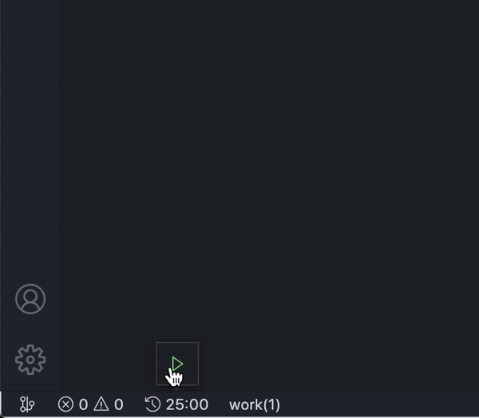

# Tick Timer for VS Code

A simple Pomodoro timer shows in the status bar.

You'll find Pomodoro button here:

After started:

>Install [Pomodoro](https://marketplace.visualstudio.com/items?itemName=lkytal.pomodoro) via vs market

## Acknowledgment

> Inspired by the [Pomodoro-code](https://marketplace.visualstudio.com/items?itemName=odonno.pomodoro-code)
> 
Icons made by <a href="http://www.flaticon.com/authors/vectors-market" title="Vectors Market">Vectors Market</a> from <a href="http://www.flaticon.com" title="Flaticon">www.flaticon.com</a> is licensed by <a href="http://creativecommons.org/licenses/by/3.0/" title="Creative Commons BY 3.0" target="_blank">CC 3.0 BY</a>

