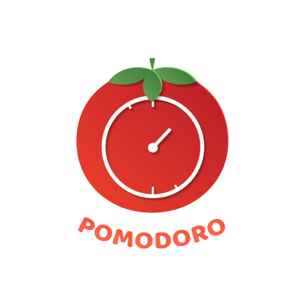
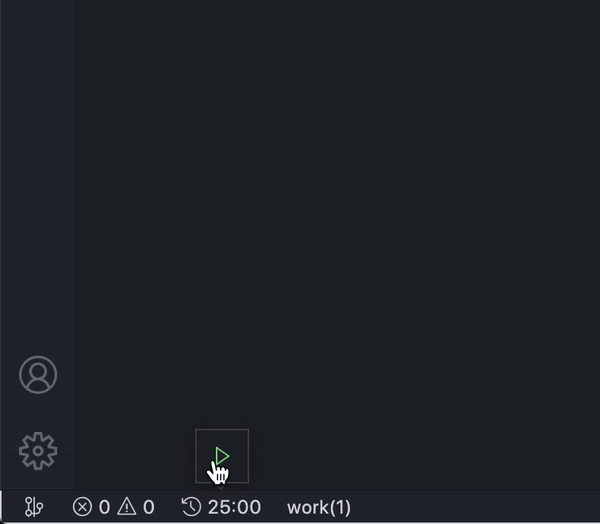
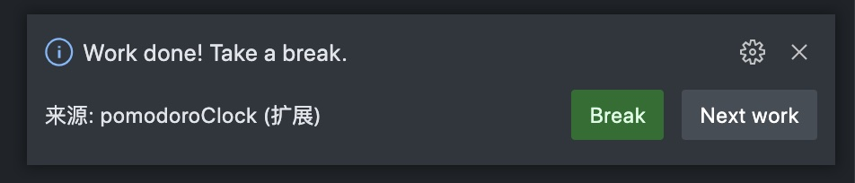
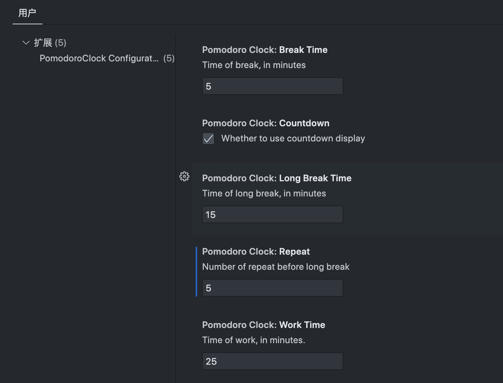

# Pomodoro Clock for VS Code

  

    
  

  

    
    
    
    
  

Pomodoro clock for VS Code -- The time management for a more productive way to work on VS Code with Pomodoro technique.

## Features

- Follow [Pomodoro technique](https://en.wikipedia.org/wiki/Pomodoro_Technique).
- After each pomodoro, we have a short break. We have long break in 1 times each 4 (can be customized) short break times.
- Extension show a count down(can be customized) clock and name of process.
- Extension will show an information box to announce.
- Be able to Start timer、Pause timer、Restart Timer、 Reset timer.

## Install
>Install [Pomodoro Clock](https://marketplace.visualstudio.com/items?itemName=jackluson.pomodoro-clock) via vs market

## Demo
A simple Pomodoro clock shows in the status bar here.

## Extension Settings
This extension contributes the following settings:

- pomodoroClock.workTime: Work time (in minutes, default is 25).
- pomodoroClock.breakTime: Short break time (in minutes, default is 5).
- pomodoroClock.longBreakTime: Long break time (in minutes, default is 15).
- pomodoroClock.repeat: Number of repeat before long break(default is 4)".
- pomodoroClock.countdown: Whether to use countdown display(default is true)".

## Development

- yarn install
- npm run watch or npm run compile
- F5 to start debugging

## Acknowledgment

> Inspired by the [Pomodoro-code](https://marketplace.visualstudio.com/items?itemName=odonno.pomodoro-code)
> 
some icons come from <a href="https://github.com/microsoft/vscode-codicons" title="vscode-codicons">vscode-codicons</a>
