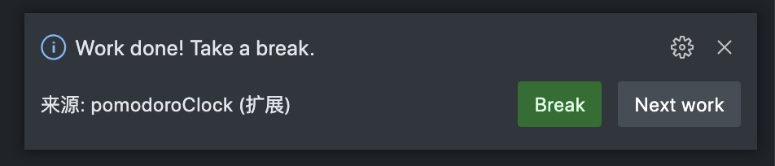

# 摸鱼写了一个番茄时钟vscode插件来摸鱼(劳逸结合)

## 想法
想找一个番茄时钟的vscode插件来劳逸结合，有规律摸鱼，翻了很多vscode 插件都不太满意，干脆自己撸了一个。

## 特性

- 遵循番茄时钟的工作方式--每1个番茄时钟有一个短休息时间，4个番茄时钟后有一个长休息时钟(支持自定义)
- 操作接触简单 -- 开始、暂停、重启、重置都可以通过点击状态栏的图标来操作
- 有一个简单的统计功能，可以统计今天的番茄时钟数
- 时间到了有通知提示，并且有快捷操作按钮
- 有切换正反计时的功能，可以用来做倒计时,也可以用来做正计时

## 实现

### 明确需求

- 番茄时钟的工作方式 -- 每1个番茄时钟有一个短休息时间，4个番茄时钟后有一个长休息时钟(支持能自定义)
- 提供操作 -- 开始、暂停、重启、重置
- 结合vscode Api 提供状态栏图标显示\命令行\通知\配置等

### 思路抽象
先抽象实现番茄时钟的功能相关类然后结合vscode api实现

- 计时器Timer类 -- 提供时钟功能，每interval 执行一次tick操作，调用`callback`
- Pomodoro类 -- 记录番茄时钟的type(休息还是工作)，状态(running、pause、done等)，还有绑定的timer
- PomodoroManager类 -- `Timer`和`Pomodoro`都是和平台无关也就是没有vscode相关的api，可以迁移到其他平台，PomodoroManager的话负责绑定Pomodoro与调用vscode api -- 绘制状态栏图标、通知、绑定命令等
- 其他 -- 在activate函数注册命令与package.json中配置的命令等，这些都是vscode约定的方式

### 细节
vscode 插件的开发可以看看官方文档，基本看完hello world与几个demo之后就可以入手了，插件所有的功能都是通过事件订阅机制实现的，而且vscode api 对象、事件划分很明确，上手不难

- [Your First Extension](https://code.visualstudio.com/api/get-started/your-first-extension)
- [vscode插件demo合集](https://github.com/microsoft/vscode-extension-samples)

主要说下番茄时钟实现的细节：为了在状态栏提供实时的时钟更新与hover上的tootip操作按钮费了一点功夫。参考vscode debug时候的状态：提供开始，暂停，恢复，重启，关闭等操作，如图：

实现如图效果：

为了实现tooltip可以操作，tooltip要是`MarkdownString` 类型，而且必须是a标签绑定command，才能触发操作。
部分代码如下：
```ts
this._commandMap = {
  start: {
    link: Uri.parse(
      `command:pomodoroClock.startPomodoro`
    ),
    imgSrc: Uri.joinPath(this.vscodeContext.extensionUri, 'assets/imgs', 'start.svg')
  }
}
const btns = [];

if (this.currentPomodoro.status === PomodoroStatus.None || this.currentPomodoro.status === PomodoroStatus.Done) {
  btns.push(`<a href="${this._commandMap.start.link}"></a>`);
}
let currentTime = this.currentPomodoro.showTime
let timerPart = this.getShowClock(currentTime)
this._clockBarText.text = `$(clock) ${timerPart}`;

const contents = new MarkdownString(btns.join('&nbsp;&nbsp;&nbsp;&nbsp;&nbsp;'), true);
contents.isTrusted = true;
contents.supportHtml = true;
this._clockBarText.tooltip = contents;
```

### 插件截图



## 插件发布

发布提供两种方式：
- 一种生成personal access token 之后， 用vsce命令行发布
- 第二种是直接在`https://marketplace.visualstudio.com/`后台上传发布

参考文档：https://code.visualstudio.com/api/working-with-extensions/publishing-extension
## 最后
大家感兴趣可以try try。

Repo: https://github.com/jackluson/vscode-pomodoro-clock
